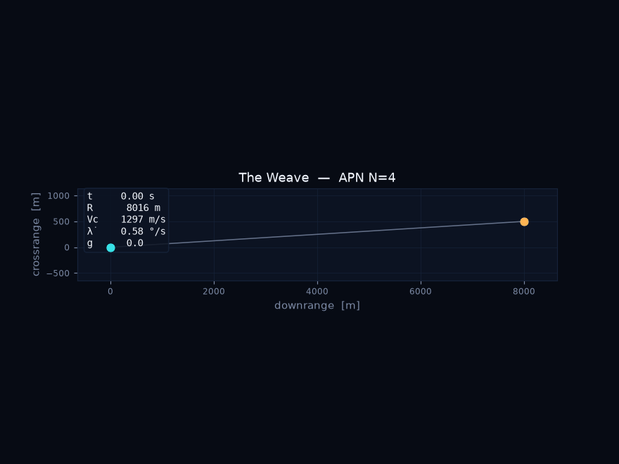
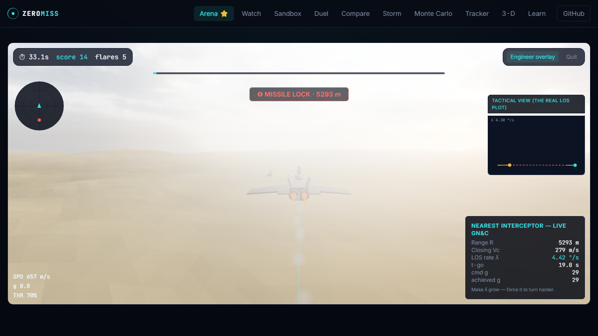
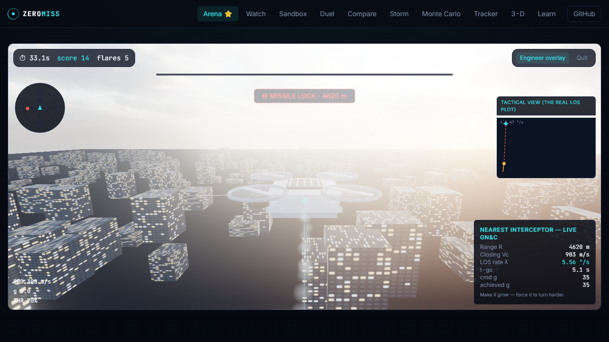
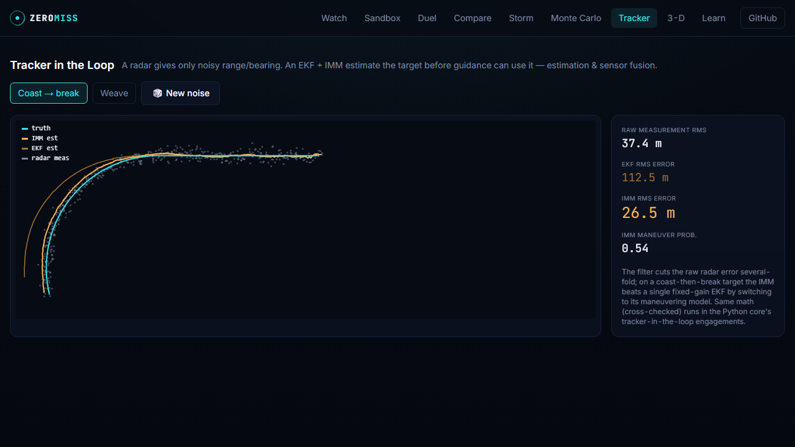
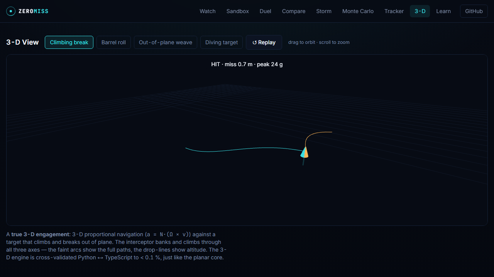
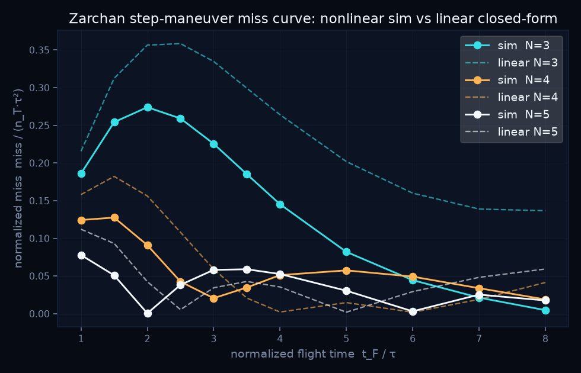
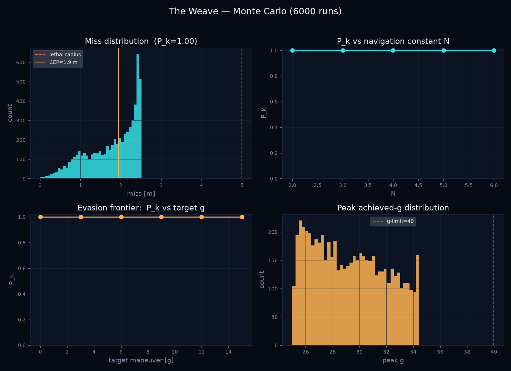

# ZeroMiss — The Interception Lab

> **Keep the bearing to your target constant, and you will collide with it.**
> A falcon catching a pigeon, an outfielder running down a fly ball, and a homing
> missile meeting a jet all solve the same problem with the same trick. ZeroMiss makes
> that hidden law — **proportional navigation** — visible, playable, and, because every
> run is reproducible from a seed and validated against the textbook, *undeniable*.

<p align="center">
  <br>
  <em>The Weave — APN, N=4, seed 1337 — HIT, miss 1.5 m. Re-run it yourself: <code>zeromiss run scenarios/the_weave.yaml --gif</code></em>
</p>

<p align="center">
  <a href="https://github.com/IsmailDayah/ZeroMiss/actions/workflows/ci.yml"></a>
  <a href="https://github.com/IsmailDayah/ZeroMiss/actions/workflows/deploy.yml"></a>
  <a href="https://zeromiss-nu.vercel.app"></a>
</p>
<p align="center">
  
  
  
  
  
  
</p>

**▶ Live demo: https://zeromiss-nu.vercel.app** · **Learn the idea:** [`/learn`](https://zeromiss-nu.vercel.app/learn) · **Fly the jet:** [`/duel`](https://zeromiss-nu.vercel.app/duel)

---

## Quickstart

### The engine (Python — the source of truth)

```bash
pip install -e ".[dev,data,media]"      # from the repo root
zeromiss list                           # the preset gallery
zeromiss run scenarios/the_weave.yaml --gif --plot
zeromiss validate                       # the whole validation suite -> a pass table
zeromiss montecarlo scenarios/the_weave.yaml --runs 20000 --out reports/
zeromiss compare scenarios/the_weave.yaml --law tpn --law apn
```

```python
from zeromiss import Engagement, scenarios

result = Engagement.from_yaml(scenarios.path("the_weave")).run(seed=42)
print(result.summary())                 # HIT  miss=1.52 m  peak_g=32.0  ...
result.to_gif("weave.gif")
result.telemetry.to_csv("weave.csv")
```

### The web app (the validated TypeScript twin)

```bash
cd web
npm install
npm run dev          # http://localhost:3000
npm run crossval     # asserts the TS twin reproduces the Python fixtures to < 0.1%
npm run build        # static export -> out/  (deploy to Vercel's edge)
```

---

## The modes

| Mode | Route | What you do |
|---|---|---|
| **Intercept Arena** ⭐ | `/arena` | **Fly an F-22 Raptor or a DJI Tello in 3-D** across four biomes (desert, ocean, city, alpine) under **real CC0 HDRI skies with image-based lighting + bloom**, and outlast a **relentless Patriot air-defence battery** that keeps firing real-ProNav interceptors — out-turn its g-limit, break seeker lock, flare it, or mask behind terrain. The game *is* the validated guidance math — toggle the engineer overlay to watch the live LOS rate + tactical plot. |
| **FPV** *(prototype)* | `/fpv` | **You are the drone.** A first-person camera over a procedural city, hunted by a battery running the same validated ProNav — fisheye, sensor grain, exposure flicker, g-load jello and a flight-controller OSD make the render read as *video* rather than graphics. |
| **Watch** | `/play` | Pick a preset (Tail Chase, The Weave, Break-Lock, Textbook Kill), sit back, share the clip. |
| **Sandbox** | `/play?adv=1` | Tune `N`, the guidance law, seeker noise, lag, g-limits, the target — live. |
| **Duel** ⭐ | `/duel` | **You fly the jet** (keys / touch) and try to evade a ProNav interceptor. |
| **Compare** | `/compare` | Same scenario, two laws (N=3 vs N=5, or TPN vs APN), side by side, synchronized. |
| **Storm** | `/storm` | A salvo: many interceptors vs many evaders, mixed laws, one shared sky. |
| **Live Monte-Carlo** | `/montecarlo` | "Run 10,000 now" — P_k forms live in the browser from the validated twin. |
| **Tracker** | `/tracker` | A radar EKF + IMM estimate a noisy track — estimation & sensor fusion, visualized. |
| **3-D View** | `/threed` | A **true 3-D engagement** — 3-D proportional navigation vs an out-of-plane climbing/barrel target (Three.js, orbit camera), cross-validated Python↔TS. |
| **Learn** | `/learn` | From frisbees to missiles — the idea, animated. |

<p align="center">
  
</p>
<p align="center"><em>The Intercept Arena — a 3-D evasion game whose interceptor runs the real, cross-validated proportional navigation. The engineer overlay (right) shows the live LOS rate, t-go and commanded-g it's driving, plus the actual tactical LOS plot.</em></p>

<p align="center">
  
  
  
</p>
<p align="center"><em>Arena (city) · Tracker (EKF vs IMM vs truth) · 3-D view — all driven by the one validated engine.</em></p>

---

## Validation against known results

ZeroMiss does not ask to be trusted; it reproduces results that are already known and
published, and fails loudly when it stops matching them. `zeromiss validate` runs all of
these as green assertions:

<p align="center">
  
</p>

- **Zero miss** on a non-maneuvering target for `N ≥ 3` (PN's defining property).
- **Heading-error washout** — an initial aim error contributes zero terminal miss.
- **The Zarchan step-maneuver curve** — the normalized miss-vs-`t_F/τ` family, with the
  correct **N-ordering** and worst-case peak (the headline validation, shown above).
- **APN cancels a step TPN cannot** — at the Zarchan worst-case the autopilot lag leaves
  TPN ~8 m short; APN's maneuver feed-forward drives it to 0.2 m (ratio 0.024).
- **RK4 order of accuracy** — quartering `dt` cuts the error ~256× (≈ O(dt⁴)).
- **Step-convergence audit** — halving `dt` barely moves the miss (integration converged).
- **Python ↔ TypeScript cross-validation** — the browser twin reproduces every Python
  reference run to **< 0.1 %**; if it ever drifts, **CI goes red**.
- **Five-language V&V** — the guidance core is independently re-implemented in **Python,
  TypeScript, MATLAB/Octave, C++ (pybind11), and a real MATLAB/Simulink block diagram**,
  and all are asserted to agree (CI runs the first four; Simulink verified on MATLAB
  R2024a). See [docs/crosslang.md](docs/crosslang.md).

> **Verify it yourself:** `pwsh -File tools/verify.ps1` runs the whole gauntlet — ruff,
> pytest (+coverage gate), the validation suite, the C++/Octave cross-checks (if those
> toolchains are present), and the web typecheck/vitest/build.

---

## Monte Carlo & probability of kill

A single engagement is an anecdote; a thousand is engineering. The campaign engine is
**NumPy-vectorised over the batch dimension** (every sample advances at once), so 10k–100k
randomised engagements run in seconds with no backend — and it agrees with the scalar
engine to machine precision.

<p align="center">
  
</p>

```bash
zeromiss montecarlo scenarios/the_weave.yaml --runs 50000 --out reports/
# -> P_k, CEP, the miss histogram, P_k-vs-N, and the evasion frontier (P_k vs target g)
```

---

## What is modelled

| Component | What it does |
|---|---|
| Guidance laws | Pursuit, PPN, TPN, APN and ZEM-optimal, selectable per run |
| Seeker | Measurement lag, angular noise, finite field of view, loss of lock |
| Airframe | Lateral acceleration limit and first-order autopilot lag |
| Estimation | A radar EKF and an IMM filter feeding the guidance loop |
| Integration | Fixed-step RK4, with an order-of-accuracy audit |
| Campaigns | Vectorised Monte-Carlo for P_k, CEP and evasion frontiers |
| Geometry | 3-DOF planar engagements and true 3-D proportional navigation |
| Countermeasures | Decoy and flare seduction; optional induced drag and gravity |
| Cross-checks | Python, TypeScript, Octave, C++ and Simulink asserted to agree |

---

## Architecture — two engines, one truth

```
scenarios/*.yaml ─► PYTHON CORE (source of truth) ─► telemetry / figures / clips / fixtures
                         dynamics · guidance · seeker · airframe
                         RK4 · state machine · Monte-Carlo · validation
                                   │  exports reference runs (fixtures/*.json)
                                   ▼
                    CROSS-VALIDATION HARNESS (Vitest, in CI)  ── asserts < 0.1% agreement
                                   │  green ⇒ the twin is trustworthy
                                   ▼
                    TYPESCRIPT TWIN (validated replica) ─► Next.js · Canvas · 60 fps ─► Vercel
```

See [`docs/`](docs/) for the physics notes and API, and [`ETHICS.md`](ETHICS.md)
for the safety and export posture.

---

## Safety, ethics & export posture

ZeroMiss is an **educational physics simulator about the universal mathematics of
pursuit** — public-domain textbook math (Zarchan; the JHU APL Technical Digest survey
papers), idealized point-mass kinematics, and a single abstract "lethal radius." It
contains **no** propulsion, warhead, real seeker, or platform data, and nothing
ITAR/EAR-controlled. See [`ETHICS.md`](ETHICS.md).

## Cite this work

Machine-readable metadata lives in [`CITATION.cff`](CITATION.cff); GitHub renders it as
**Cite this repository** in the sidebar.

```bibtex
@software{abdullahi_zeromiss,
  author  = {Abdullahi, Ismail Dayah},
  title   = {{ZeroMiss}: a validated missile-guidance interception simulator},
  version = {0.1.0},
  year    = {2026},
  url     = {https://github.com/IsmailDayah/ZeroMiss}
}
```

## License

MIT — see [`LICENSE`](LICENSE).
